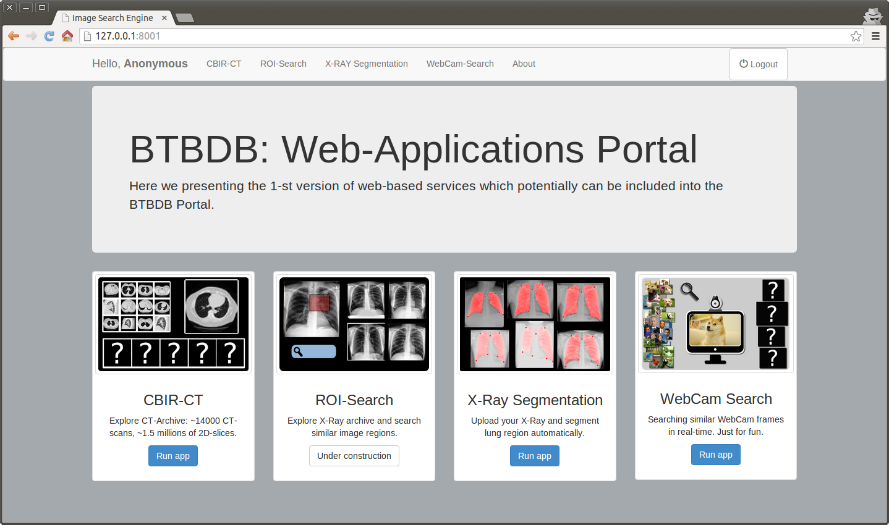

webcrdf-testbed
=======
    Django project (Only for testing) with some demo applications: 
    X-Ray segmentation, WebCam-CBIR

Parent project: http://tuberculosis.by/

Permanent link (for complete project): http://imlab.grid.by

External image-processing tools:
  - opencv (http://opencv.org/)
  - scikit-image (http://scikit-image.org/)
  - scikit-learn (http://scikit-learn.org/)
  - elastix (http://elastix.isi.uu.nl/)

